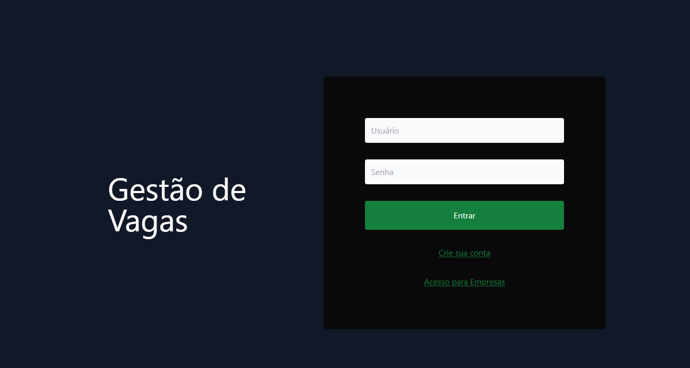

# Gestao de Vagas




Projeto de portfolio que implementa uma plataforma de gestao de vagas com dois modulos Spring Boot:
uma API REST para cadastro, autenticacao e fluxo de candidaturas, e uma aplicacao web server-side com Thymeleaf consumindo essa API.

**Funcionalidades principais**

- Cadastro e autenticacao de candidatos.
- Cadastro e autenticacao de empresas.
- Consulta de perfil do candidato autenticado.
- Cadastro de vagas por empresas autenticadas.
- Listagem de vagas publicadas pela empresa autenticada.
- Busca de vagas para candidatos com filtro por texto.
- Candidatura em vagas.
- Interface web com telas separadas para candidato e empresa.
- Documentacao da API com Swagger/OpenAPI.
- Exposicao de metricas com Spring Boot Actuator e Prometheus.

**Tecnologias utilizadas**

- Java 17
- Spring Boot
- Spring Web
- Spring Data JPA
- Spring Security
- Spring Validation
- Thymeleaf
- PostgreSQL
- H2 Database para testes
- JWT com `java-jwt`
- springdoc OpenAPI / Swagger UI
- Spring Boot Actuator
- Micrometer + Prometheus
- JUnit, Mockito e Spring Security Test
- Docker e Docker Compose

**Arquitetura do projeto**

O repositorio esta dividido em dois modulos independentes:

- `backend/`: API REST responsavel por regras de negocio, autenticacao JWT, persistencia e monitoramento.
- `frontend/`: aplicacao Spring MVC com Thymeleaf que consome a API via `RestTemplate`.

No backend, a organizacao segue separacao por dominio e responsabilidade:

- `modules/candidate`: cadastro, autenticacao, perfil, busca de vagas e candidatura.
- `modules/company`: cadastro, autenticacao, criacao e listagem de vagas.
- `security`: filtros JWT para candidato e empresa, alem da configuracao do Spring Security.
- `providers`: validacao e leitura dos tokens JWT.
- `exceptions`: tratamento centralizado de erros.
- `config`: configuracao de Swagger/OpenAPI.

No frontend, as rotas MVC renderizam templates Thymeleaf e delegam as chamadas HTTP para services:

- `modules/candidate/controller`: login, cadastro, perfil, busca de vagas e candidatura.
- `modules/company`: cadastro, login, criacao de vagas e listagem.
- `src/main/resources/templates`: paginas HTML para candidato e empresa.

**Estrutura de pastas**

```text
.
|-- backend
|   |-- Dockerfile
|   |-- docker-compose.yml
|   `-- src
|       |-- main
|       |   |-- java
|       |   `-- resources
|       `-- test
|-- frontend
|   `-- src
|       |-- main
|       |   |-- java
|       |   `-- resources/templates
|       `-- test
|-- images
`-- README.md
```

**Fluxo principal da aplicacao**

1. O usuario cria conta como candidato ou empresa.
2. O backend autentica e retorna um token JWT com perfil correspondente.
3. O frontend armazena o token na sessao Spring Security.
4. Empresas autenticadas cadastram e listam suas vagas.
5. Candidatos autenticados consultam o proprio perfil, buscam vagas por filtro e realizam candidaturas.

**Como rodar localmente**

**Pre-requisitos**

- Java 17
- Docker e Docker Compose

**1. Subir a infraestrutura do backend**

```bash
cd backend
docker compose up -d
```

Isso sobe:

- PostgreSQL em `localhost:5432`
- Prometheus em `http://localhost:9090`
- Grafana em `http://localhost:3000`

**2. Rodar o backend**

Windows:

```bash
cd backend
mvnw.cmd spring-boot:run
```

Linux/macOS:

```bash
cd backend
./mvnw spring-boot:run
```

API disponivel em `http://localhost:8080`.

**3. Rodar o frontend**

Windows:

```bash
cd frontend
mvnw.cmd spring-boot:run
```

Linux/macOS:

```bash
cd frontend
./mvnw spring-boot:run
```

Aplicacao web disponivel em `http://localhost:8082`.

Importante: o frontend depende do backend em execucao e, por padrao, espera a API em `http://localhost:8080`.

**Configuracao de ambiente**

Hoje o projeto nao possui `.env.example`. As configuracoes estao em arquivos `application.properties`:

- `backend/src/main/resources/application.properties`
- `frontend/src/main/resources/application.properties`

Configuracoes relevantes encontradas no codigo:

- Backend: `spring.datasource.url`
- Backend: `spring.datasource.username`
- Backend: `spring.datasource.password`
- Backend: `security.token.secret`
- Backend: `security.token.secret.candidate`
- Frontend: `server.port=8082`
- Frontend: `host.api.gestao.vagas=http://localhost:8080`

Recomendacao para uso profissional:

- mover credenciais e segredos para variaveis de ambiente ou perfis locais;
- adicionar um `.env.example` ou um `application-example.properties`;
- remover segredos e tokens sensiveis versionados.

**Docker**

O repositorio possui suporte Docker no modulo `backend`:

- `backend/docker-compose.yml`: sobe PostgreSQL, Prometheus e Grafana.
- `backend/Dockerfile`: gera a imagem da API Spring Boot.

O frontend nao possui `Dockerfile` nem `docker-compose` proprios neste repositorio.

**Banco de dados e persistencia**

- Banco principal: PostgreSQL.
- Banco de testes: H2 em memoria.
- ORM: Spring Data JPA / Hibernate.
- Estrategia atual de schema: `spring.jpa.hibernate.ddl-auto=update`.

Observacao importante: nao ha migrations versionadas com Flyway ou Liquibase neste repositorio. O schema e atualizado automaticamente pelo Hibernate em ambiente local.

**Testes**

O backend possui testes automatizados em `backend/src/test/java`, incluindo:

- teste de use case para candidatura em vaga;
- teste de controller para criacao de vaga com seguranca.

Para executar:

```bash
cd backend
mvnw.cmd test
```

No Linux/macOS:

```bash
cd backend
./mvnw test
```

O frontend possui classe de teste base do Spring Boot, mas a cobertura automatizada do modulo e minima no estado atual.

**Documentacao e monitoramento**

- Swagger UI: `http://localhost:8080/swagger-ui/index.html`
- OpenAPI docs: `http://localhost:8080/v3/api-docs`
- Actuator health: `http://localhost:8080/actuator/health`
- Actuator Prometheus: `http://localhost:8080/actuator/prometheus`
- Prometheus: `http://localhost:9090`
- Grafana: `http://localhost:3000`

**Principais endpoints da API**

**Candidato**

- `POST /candidate/`: cadastrar candidato
- `POST /candidate/auth`: autenticar candidato
- `GET /candidate/`: buscar perfil do candidato autenticado
- `GET /candidate/job?filter=texto`: listar vagas filtradas
- `POST /candidate/job/apply`: candidatar-se a uma vaga

**Empresa**

- `POST /company/`: cadastrar empresa
- `POST /company/auth`: autenticar empresa
- `POST /company/job/`: criar vaga
- `GET /company/job/`: listar vagas da empresa autenticada

**Rotas principais da interface web**

**Candidato**

- `GET /candidate/create`
- `GET /candidate/login`
- `GET /candidate/profile`
- `GET /candidate/jobs`

**Empresa**

- `GET /company/create`
- `GET /company/login`
- `GET /company/jobs`
- `GET /company/jobs/list`
